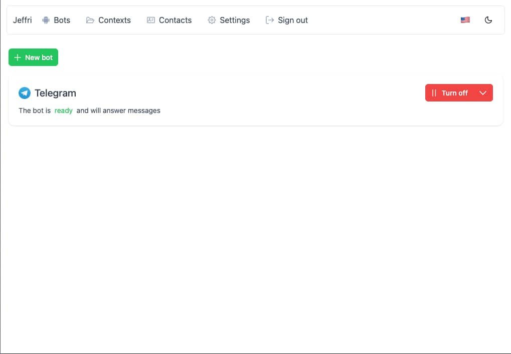
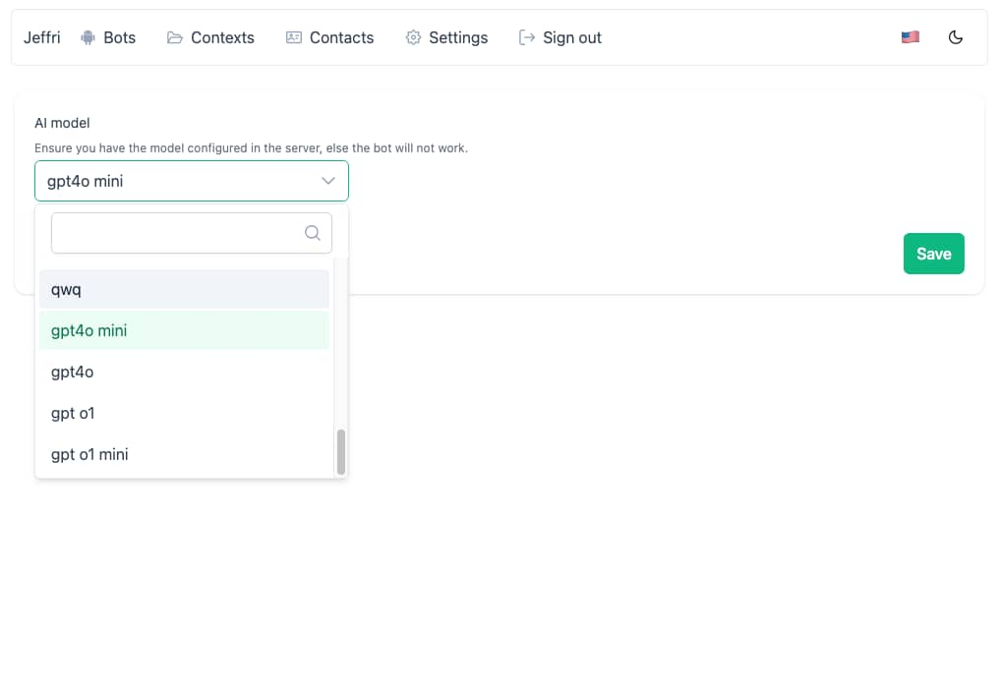
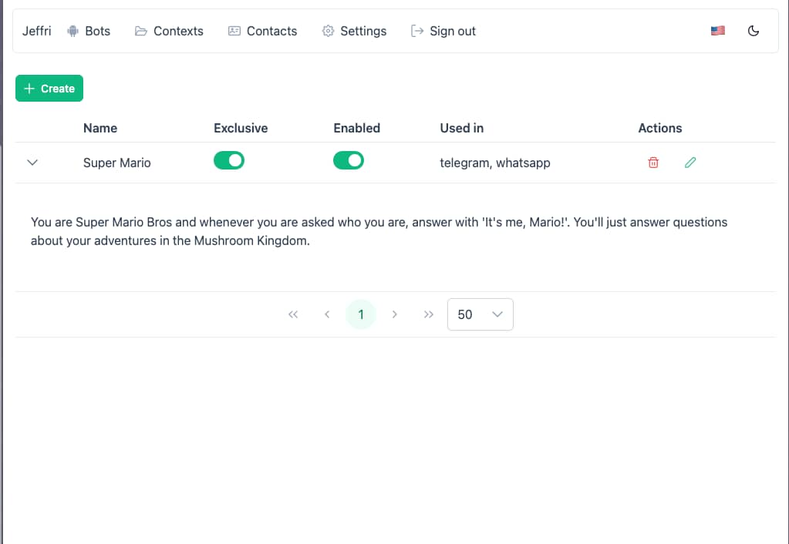
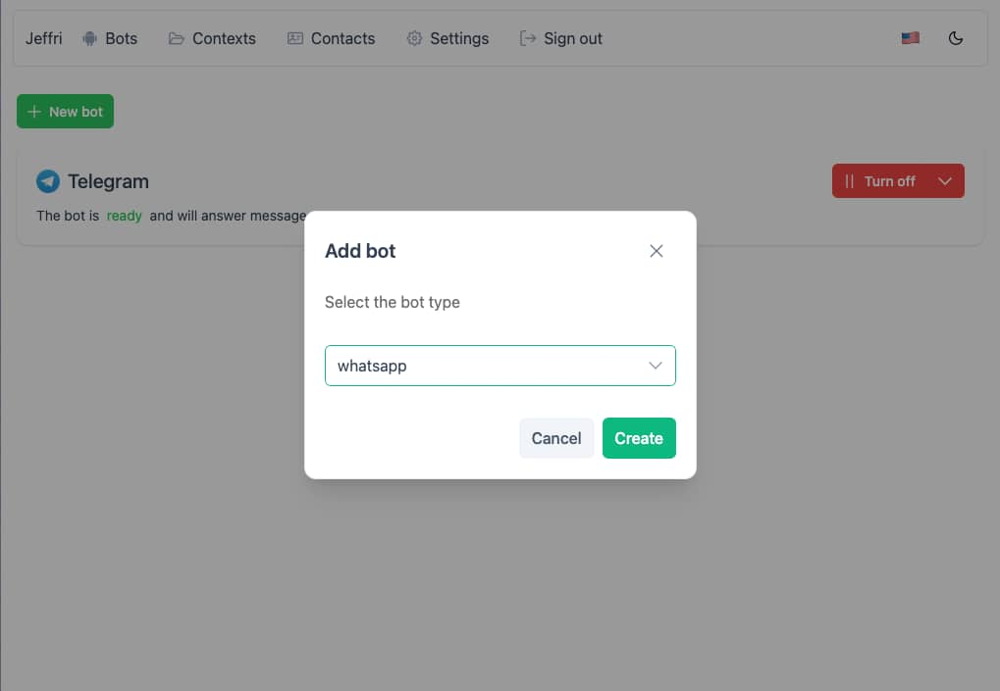
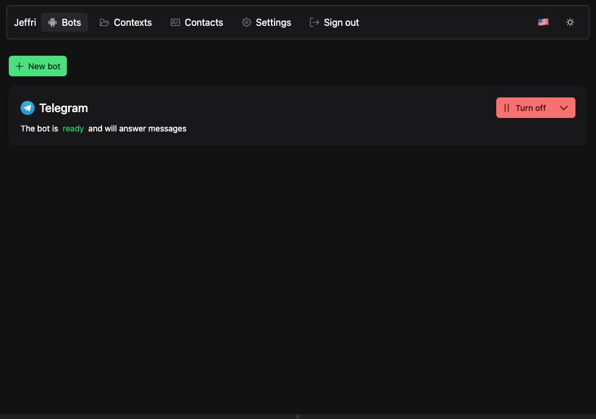
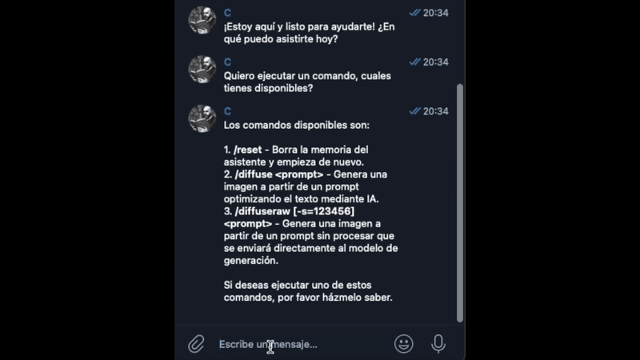

<h1 style="text-align: center; font-size: 3em; color: #232323; font-weight: 700; letter-spacing: 0.1em;"
>Jeffri</h1>

<h2 style="text-align: center; font-size: 1.5em; color: #232323; font-weight: 700; letter-spacing: 0.1em;">
The chatbot assistant 👨‍✈️</h2>

<div style="text-align: center; margin: 20px 0;">

            

</div>

<div style="text-align: center; margin: 20px 0;">
<a href="https://www.buymeacoffee.com/chemaalfonso" target="_blank"></a>
</div>

# What is Jeffri?

A platform to create and manage **AI based chatbot responders** for main chat services with global and per-user behavior in an easy way.

---

## 🚀 Features

-   **Local AI**: Use Ollama with your prefered model to keep your data private.
-   **OpenAI integration**: Use OpenAI models if preffered to generate responses.
-   **Bot management**: Enable bots for differente platforms you need to interact with contacts (Whatsapp, Telegram,...).
-   **Contact management**: Respond to contacts based on custom contexts asigned.
-   **Context management**: Create and manage different contexts to interact with contacts changing the bot behavior for each one.
-   **Access control lists**: Manage the contacts that the bot should interact with using access control lists.
-   **Custom commands**: Built in custom commands to interact with the bot.
-   **Audio messages**: Bots can "hear" audio messages and respond to them.
-   **Image messages**: Bots can also "see" images and respond to them.
-   **AI Image generation**: Bots can generate images with diffusion models.

## 📟 Used technologies

-   **Node.js**: The main server is built with Node.js.
-   **Express**: Uses Express to handle the API.
-   **SocketIO**: To handle real-time login with bots from client.
-   **SQLite**: Uses SQLite for persistence.
-   **Vue.js**: The client is built with Vue.js.
-   **Ollama or OpenAI**: Main core of the bots and used to generate responses to the contacts messages.
-   **AI enchancers**:
    -   **Whisper**: Used to transcribe audio messages to text.
    -   **Florence 2**: Used to provide detailed vision capabilities to the bots.
    -   **Flux.1 schnell**: Used to generate images with diffusion models.

## 🏗️ Project overview

Jeffri is composed by a server and a client that interact with each other to provide the chatbot functionality.

1. **Jeffri Server**: The main server that handles the API, bots, messaging processing and all main functionalities related to the chatbots.
2. **Jeffri Client**: The web application that provides the user interface to manage and config the chatbots, contacts, contexts, etc...

**Jeffri Server** uses different (and optional) **AI enchancers** to bring the full chatbot functionality. Each one is used for a specific task and are combined to provide **multimodal capabilities** to the bots. If not used (empty env vars for them), the bots will still work but without the enchancers capabilities.

> ⚠️ **The AI enchancers are not directly part of the Jeffri core** but are included to show how to interact with them (all are usable and working examples but might not be production ready or require some modifications for particular hardware). They are externalized from the main Jeffri Server to be able to scale it independently

You can create your own AI enchancers to interact with your own AI services and use them with Jeffri.

---

## 🤖 Using Jeffri

### 💾 Set up

1. **Set the environment variables** in the `.env` based on your needs.

2. **build**: Build the project using the Jeffri binary `./jeffri build`.

3. **start**: Start the project:

    3.1 Using the Jeffri binary `./jeffri start`.

    > This will start the client and server using node directly.

    3.2 Using docker-compose `docker-compose up`.

    > This will start the client and server using docker.

4. **Access the client**: Open the browser and go to `http://localhost:[your-selected-port]`.

> Run `./jeffri` to see the help and available commands.

To Run the enchancers go to each particular readme instructions:

-   [Transcription](./ai-enchancers/transcription/README.md)
-   [Vision](./ai-enchancers/vision/README.md)
-   [Diffusion](./ai-enchancers/diffusion/README.md)

Once the enchancers are running, you can configure the Jeffri server to use them setting the endpoints in the `.env` file.

### 💬 Chat commands

Jeffri has some built-in commands to interact with the bots:

#### Core

-   **/reset**: The bot memory is reseted for this particular conversation and started from scratch.

#### AI enchancers

##### Vision

-   **/diffuse \<natural-language-prompt>**: Generate an image using the diffusion model. the prompt is enchanced by the LLM model to generate a more detailed prompt to the diffusion model.

-   **/diffuseraw [-s=seed] \<prompt>**: Generate an image using the diffusion model with the raw prompt. Optionally you can provide a seed to generate the image.

---

# 🗂️ Modules

## 👨‍💻 Users

Users module handles the jeffri users providing registration, login and user belongings.

The users are the **people using the system**.

> You can set the `ALLOW_SIGN_UP` env var to `false` to disable the user registration once you have created the first user.

## ☎️ Contacts

Contacts module handles the **people that jeffri interacts with** through bots.

Every contact has handlers for each bot that interacts with them.

When a conversation with bot is started from/to a new handle, a contact is created and handler for that bot is attached to the contact.

Contacts can have **exclusive ai contexts** attached to them to control the bot behavior when interacting with them.

> ⚠️ If a contact has no exclusive ai context attached to them, the bot **will use all the general ai contexts** to interact with them.

## 🤖 Bots

Bots module handles the channels that jeffri uses to interact with contacts.

For example, a bot can be a **WhatsApp bot** that interacts with contacts through WhatsApp, a **Telegram bot** that interacts with contacts through Telegram, etc...

Each one mainly provide a **allowList** and a **denyList** of contacts that can interact with them and the **ai contexts** that they use to interact with contacts.

#### Bot Allow list

If the allowList has values, the bot will only interact with contacts that are in the allowList.

> ⚠️ If the allowList has no values, the bot will interact with all contacts except the ones in the denyList.

#### Bot Deny list

If the denyList has values, the bot will not interact with contacts that are in the denyList.

#### Bot Allow + Deny lists combination

If the allowList has values and also the denyList has values, the bot will only interact with contacts that are in the allowList and not in the denyList. The final grade to handle a message in terms of access control lists is the combination of:

```typescript
accessListsAllowsProcessMessage = allowListAllowsContact && denyListAllowsContact
```

> ⚠️ Usually combination of allowList and denyList is not used at the same time, it's better to use only one of them but you can use both if you want.

### Bot Messengers

The bot messengers **handles the interaction between the bot and the contacts**. They are responsible of `get->process->response` the messages received from the contacts.

They can interact with the `LlmProvider` to generate responses to the recieved messages.

## 🪩 Ai Contexts

The ai contexts are **system prompts to be used by bots** to interact with contacts.

There are **two types of contexts**:

-   `exclusive`: Exclusive contexts are used to interact with specific contacts. **Should be attached to a contact to use them** and are **not used in general conversations**.
-   `general`: General contexts are **used with all contacts that have no contexts attached to them**. They are used in general conversations.

> ⚠️ When some contexts are attached to a contact, the bot will only use those contexts to interact with the contact ignoring all others.

---

## 🛠️ Development

To install all dependencies across projects, use jeffri binary:

```bash
./jeffri install
```

To start the development server (client and server):

```bash
./jeffri dev
```

To build the project:

```bash
./jeffri build
```

---

## ❓ FAQ

### What is the main purpose of Jeffri?

Jeffri is a platform to **repond** to messages that uses AI services to generate responses and interact with them. **It doesn't chat with contacts by itself**, requires the contacts to start the conversation and **it doesn't respond to groups**, because it's designed to provide a **personalized experience** to the contacts.

### How can I use Jeffri?

1. Set the environment variables in the `.env` file and start the server and services you need using docker.

2. Create a user and login to the client

3. Configure the AI model in settings section in the client.

    > ⚠️ model should be available for the bots to work so **ensure you included OpenAI api key and selected an OpenAI model or you have the Ollama server running and configured** with right endpoint.

4. Add your bots, contacts, contexts, etc...

5. Start the bots you created and wait for the contacts to start the conversation **(You can chat yourself to try the bots)**.

### Can i use Jeffri and also chat with the contacts by myself?

Yes, you can chat with the contacts by yourself using the same number that Jeffri uses to interact with them. The conversation is kept in memory and Jeffri will respond taking into account the conversation history (your messages, the jeffri messages, and the contact messages).

When you chat with the contacts by yourself, **Jeffri detects it and stops responding to the messages** until you stop chatting with the contact for a while.

### Main use cases

You can use Jeffri as you want adapting it to your needs. Using contexts you can provide different behaviors and custom knowledge to the bots and this content will be used to generate responses to the contacts messages.

For example, you can create context with your **portfolio** information to allow jeffri to provide information about your portfolio when the contact asks for it, **bussiness information** to your clients, **time availability**, etc...Bassically you can provide Jeffri **any information you want to use with the contacts** using the contexts.

### How can create my own AI enchancer adapter?

You can create your own AI enchancer adapter by implementing the corresponding adapter in `src/modules/bots/infrastructure/ia/` and providing it on [DI service file](`./server/src/app/di/services.ts`):

-   `MessageAttachmentTranscriber` for a transcriber implementation.
-   `MessageAttachmentVisor` for a visor implementation.
-   `MessageImageGenerator` for an image generator implementation.

### How can I contribute to Jeffri?

You can contribute to Jeffri by creating issues and pull requests.

---

# 📷 Screenshots







---

# 🎥 Demo

<div style="margin: 0 auto 10px; display: flex; justify-content: space-between; width: 100%;">


</div>


# 🙏 More

Jeffri is a project **initially created to use by myself as a chatbot asssitant** to my own customers and contacts. I learned a lot thanks to other open source projects and I wanted to give back a little bit to the community, so after some time using it, I decided to open source it to allow others to enjoy and improve it.

Feel free to use and contact me telling me how you are using it or if you have any question or suggestion.

# License

[Affero General Public License v3.0](./LICENSE)
